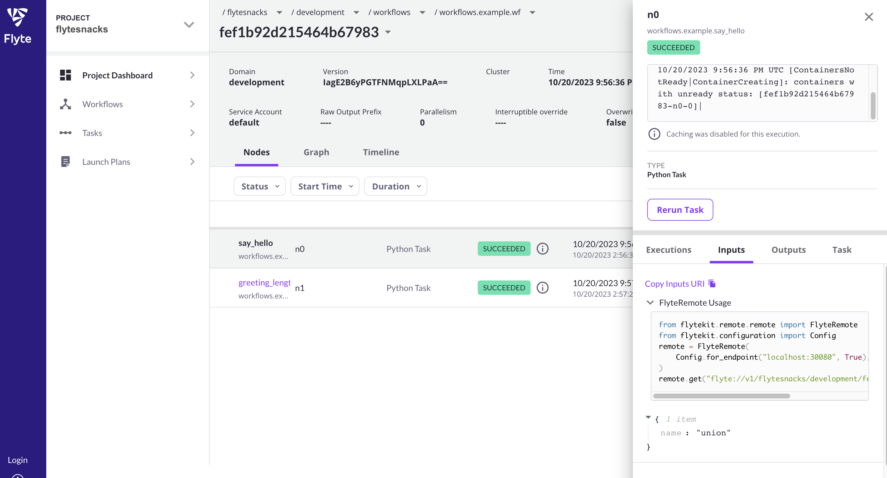

# Nebula v1.10.0 Release

This release marks the move to the (monorepo](https://github.com/nebulaclouds/nebula/pull/4014). From now on the development of backend components is going to be done in the Nebula [main repo](https://github.com/nebulaclouds/nebula/).

Nebula Agents are also getting a major lift. They are not only more performant, but we're also announcing support for a variety of agents, including [Airflow](https://github.com/nebulaclouds/nebulakit/pull/1725), [Memverge](https://github.com/nebulaclouds/nebulakit/pull/1821), [Snowflake](https://github.com/nebulaclouds/nebulakit/pull/1799), [Databricks](https://github.com/nebulaclouds/nebulakit/pull/1797).

Programmatically consuming inputs and outputs using nebularemote became a lot easier with the introduction of code snippets directly in the UI. For example, notice the small blurbs below inputs and outputs in the side panel:

You'll now be able to use offloaded types in [eager workflows](https://docs.nebula.org/projects/cookbook/en/latest/auto_examples/advanced_composition/eager_workflows.html#id1).

More ergonomic improvements to [pynebula](https://docs.nebula.org/projects/nebulakit/en/latest/pynebula.html#pynebula-cli), including the inclusion of a progress bar, the ability to activate launchplans, and the ability to interact with gate nodes in local executions.

And much more. Here's the exhaustive list of changes:

### Nebulakit
* Better error messaging for overrides by @kumare3 in https://github.com/nebulaclouds/nebulakit/pull/1807
* Run remote Launchplan from `pynebula run` by @kumare3 in https://github.com/nebulaclouds/nebulakit/pull/1785
* Add is none function by @pingsutw in https://github.com/nebulaclouds/nebulakit/pull/1757
* Dynamic workflow should not throw nested task warning by @oliverhu in https://github.com/nebulaclouds/nebulakit/pull/1812
* Add a manual image building GH action by @wild-endeavor in https://github.com/nebulaclouds/nebulakit/pull/1816
* Enable Azure Workload Identity for `fsspec` in `nebulakit` by @fiedlerNr9 in https://github.com/nebulaclouds/nebulakit/pull/1813
* Fix list of annotated structured dataset by @wild-endeavor in https://github.com/nebulaclouds/nebulakit/pull/1817
* Support the nebulactl config.yaml admin.clientSecretEnvVar option in nebulakit by @chaohengstudent in https://github.com/nebulaclouds/nebulakit/pull/1819
* Async agent delete function for while loop case by @Future-Outlier in https://github.com/nebulaclouds/nebulakit/pull/1802
* fix docs warnings by @samhita-alla in https://github.com/nebulaclouds/nebulakit/pull/1827
* Fix extract_task_module by @pingsutw in https://github.com/nebulaclouds/nebulakit/pull/1829
* Feat: Add type support for pydantic BaseModels by @ArthurBook in https://github.com/nebulaclouds/nebulakit/pull/1660
* Make NebulaRemote example slightly more copy/pastable by @katrogan in https://github.com/nebulaclouds/nebulakit/pull/1830
* Pynebula meta inputs by @kumare3 in https://github.com/nebulaclouds/nebulakit/pull/1823
* Use mashumaro to serialize/deserialize dataclass by @hhcs9527 in https://github.com/nebulaclouds/nebulakit/pull/1735
* Databricks Agent by @Future-Outlier in https://github.com/nebulaclouds/nebulakit/pull/1797
* Prometheus metrics by @pingsutw in https://github.com/nebulaclouds/nebulakit/pull/1815
* Pynebula register optionally activates schedule by @kumare3 in https://github.com/nebulaclouds/nebulakit/pull/1832
* Remove versions 3.9 and 3.10 by @wild-endeavor in https://github.com/nebulaclouds/nebulakit/pull/1831
* Snowflake agent by @hhcs9527 in https://github.com/nebulaclouds/nebulakit/pull/1799
* Update agent metric name by @pingsutw in https://github.com/nebulaclouds/nebulakit/pull/1835
* MemVerge MMCloud Agent by @edwinyyyu in https://github.com/nebulaclouds/nebulakit/pull/1821
* Add download badges to the readme by @pingsutw in https://github.com/nebulaclouds/nebulakit/pull/1836
* Eager local entrypoint and support for offloaded types by @cosmicBboy in https://github.com/nebulaclouds/nebulakit/pull/1833
* update requirements and add snowflake agent to api reference by @samhita-alla in https://github.com/nebulaclouds/nebulakit/pull/1838
* Fix: Make sure decks created in elastic task workers are transferred to parent process by @fg91 in https://github.com/nebulaclouds/nebulakit/pull/1837
* add accept grpc by @wild-endeavor in https://github.com/nebulaclouds/nebulakit/pull/1841
* Feat: Enable `nebulakit` to authenticate with proxy in front of NebulaAdmin by @fg91 in https://github.com/nebulaclouds/nebulakit/pull/1787
* Backfill command now supports failure-policy by @kumare3 in https://github.com/nebulaclouds/nebulakit/pull/1840
* Pass cluster pool when creating executions by @iaroslav-ciupin in https://github.com/nebulaclouds/nebulakit/pull/1208
* Add more clear error  message when fetching secrets by @ysysys3074 in https://github.com/nebulaclouds/nebulakit/pull/1847
* Pynebula run workflows correctly handles Optional[TYPE] = None by @cosmicBboy in https://github.com/nebulaclouds/nebulakit/pull/1849
* Bump gitpython from 3.1.32 to 3.1.35 in /tests/nebulakit/integration/remote/mock_nebula_repo/workflows by @dependabot in https://github.com/nebulaclouds/nebulakit/pull/1828
* Bump cryptography from 41.0.3 to 41.0.4 in /tests/nebulakit/integration/remote/mock_nebula_repo/workflows by @dependabot in https://github.com/nebulaclouds/nebulakit/pull/1844
* update codecov config in pythonbuild ci by @cosmicBboy in https://github.com/nebulaclouds/nebulakit/pull/1852
* Improved gate node handling by @kumare3 in https://github.com/nebulaclouds/nebulakit/pull/1850
* update codecov yaml, make eager wf test more stable by @cosmicBboy in https://github.com/nebulaclouds/nebulakit/pull/1854
* more codecov updates by @cosmicBboy in https://github.com/nebulaclouds/nebulakit/pull/1856
* make mlflow plugin work with python 3.11 by @bcvanmeurs in https://github.com/nebulaclouds/nebulakit/pull/1855
* Agent get secret function by @Future-Outlier in https://github.com/nebulaclouds/nebulakit/pull/1851
* Better Azure blob storage support  by @Tom-Newton in https://github.com/nebulaclouds/nebulakit/pull/1842
* Remove Envd from dockerfile by @pingsutw in https://github.com/nebulaclouds/nebulakit/pull/1814
* Update agent uri format by @hhcs9527 in https://github.com/nebulaclouds/nebulakit/pull/1861
* modified setup.py in nebulakit-mmcloud by @helenzhangyc in https://github.com/nebulaclouds/nebulakit/pull/1864
* Label request_failure metric with error_code by @pingsutw in https://github.com/nebulaclouds/nebulakit/pull/1862
* add back Edwin's name by @helenzhangyc in https://github.com/nebulaclouds/nebulakit/pull/1868
* Fix py38 aync agent service and add async agent test by @Future-Outlier in https://github.com/nebulaclouds/nebulakit/pull/1866
* Pin because not installing by @wild-endeavor in https://github.com/nebulaclouds/nebulakit/pull/1872
* Bump pillow from 10.0.0 to 10.0.1 in /tests/nebulakit/integration/remote/mock_nebula_repo/workflows by @dependabot in https://github.com/nebulaclouds/nebulakit/pull/1867
* Prune hosted github runner to free up space for sandbox by @jeevb in https://github.com/nebulaclouds/nebulakit/pull/1875
* Fixes Auth issue, where refresh token is expired by @kumare3 in https://github.com/nebulaclouds/nebulakit/pull/1873
* Name field is incorrect assigned by @kumare3 in https://github.com/nebulaclouds/nebulakit/pull/1874
* [Docs]Updated examples for customizing resources by @LunarMarathon in https://github.com/nebulaclouds/nebulakit/pull/1871
* change key path to SNOWFLAKE_PRIVATE_KEY by @hhcs9527 in https://github.com/nebulaclouds/nebulakit/pull/1879
* Run notebook task on aws batch by @pingsutw in https://github.com/nebulaclouds/nebulakit/pull/1859
* Automatically Convert `name` Argument and `registry`  Argument to Lowercase in ImageSpec by @Future-Outlier in https://github.com/nebulaclouds/nebulakit/pull/1881
* Dep: Pin min required nebulakit version in IAP plugin by @fg91 in https://github.com/nebulaclouds/nebulakit/pull/1878
* Remove duplicate click option by @wild-endeavor in https://github.com/nebulaclouds/nebulakit/pull/1883
* Bump urllib3 from 1.26.16 to 1.26.17 in /tests/nebulakit/integration/remote/mock_nebula_repo/workflows by @dependabot in https://github.com/nebulaclouds/nebulakit/pull/1865
* Improve error message in ListTransformer when not passing a list by @fg91 in https://github.com/nebulaclouds/nebulakit/pull/1882
* Update `typing_extension` Any import to typing due to `typing_extension` version compatibility by @hfurkanvural in https://github.com/nebulaclouds/nebulakit/pull/1877
* Bump gitpython from 3.1.35 to 3.1.37 in /tests/nebulakit/integration/remote/mock_nebula_repo/workflows by @dependabot in https://github.com/nebulaclouds/nebulakit/pull/1885
* Airflow agent by @pingsutw in https://github.com/nebulaclouds/nebulakit/pull/1725
* Add mmcloud plugin into the agent image by @pingsutw in https://github.com/nebulaclouds/nebulakit/pull/1891
* Fix map_task sensitive to argument order by @chaohengstudent in https://github.com/nebulaclouds/nebulakit/pull/1888
* Add enable_deck to task decorator by @eapolinario in https://github.com/nebulaclouds/nebulakit/pull/1898
* Add image transformer by @pingsutw in https://github.com/nebulaclouds/nebulakit/pull/1901
* add default project domain in execute launch plan by @troychiu in https://github.com/nebulaclouds/nebulakit/pull/1894
* Add Databricks and Snowflake agent  to Dockerfile by @Future-Outlier in https://github.com/nebulaclouds/nebulakit/pull/1905
* Fix module loading bug in instance tracker class by @cosmicBboy in https://github.com/nebulaclouds/nebulakit/pull/1902

### Nebulaadmin
* Fixed bug for incorrect name (#4175)
* Add version control for ArrayNode eventing (#4165)
* Update golang experimental dep (#4177)
* Add Additional gRPC service handler hook (#4171)
* Handle batched TaskExecutionEvent reasons (#615)
* Lint nebulaadmin/auth/handlers_test.go
* #patch Update FromWorkflowModel API (#617)
* add codespell: config, workflow and have typos fixed (#4054)
* Handle batched TaskExecutionEvent reasons (#615)
* Update FromWorkflowModel API (#617)
* Update boilerplate version (#605)
* Reduce a warning to info (#612)
* Logout hook plugin (#611)
* Expire nebula_idt cookie at logout (#610)
* Use configured domain on expired cookies (#608)
* Fix list named entities (#609)
* Merge pull request from GHSA-r847-6w6h-r8g4
* Update boilerplate version (#604)
* Handle grpc error explicitly (#602)
* Introduce pre redirect hook plugin during auth callback (#601)
* Add default cluster pool assignments to config (#600)
* Implement Sandbox notifications processor and publisher (#595)

### Nebulapropeller
* [Extended Resources] GPU Accelerators (#4172)
* [Monorepo] Enable proxy-authorization in admin client (#4189)
* (monorepo--importing-nebulaidl-452) Add version control for ArrayNode eventing (#4165)
* Update golang experimental dep (#4177)
* Moving from nebulapropeller - Adding flags for ignore-retry-cause and default-max-attempts (#4153)
* [Monorepo] Rename nebulaidl (#4166)
* Revert add supported task types for agent service by default for task types (#4162)
* reverting to parallelism increases only on non-terminal phase updates (#624)
* Add k8s events to task phase updates (#600)
* Ray log links (#620)
* Add supportTaskTypes for agentservice without write it in config twice. (#612)
* Bump nebulastdlib version (#619)
* added check for invalid argument code on node event recording failure (#613)
* start informerFactory by default. (#614)
* bumped nebulaplugins to v1.1.23 (#616)
* fixing boilerplate (#617)
* Supporting using arraynode as a subnode (#606)
* fixing max parallelism (#611)
* adding controller-runtime manager metrics handler to http endpoint (#607)
* pulled latest boilerplate (#609)
* Move caching to node executor for fast cache hits (#485)

### Nebulaplugins
* Update the item only if it exists in the cache (#4117)
* [Extended Resources] GPU Accelerators (#4172)
* Implement Spark pod template overrides (#4183)
* Support Evaluator in Kubeflow TensorFlow Training Operator (#4168)
* Agent Get Pending Message (#4106)
* Moving from nebulapropeller - Adding flags for ignore-retry-cause and default-max-attempts (#4153)
* change to tf job worker spec (#4169)
* Return ResourceWrapper without pointer (#4115)
* Revert add supported task types for agent service by default for task types (#4162)
* Plugin changes for plumbing k8s events into TaskExecutionEvent (#406)
* Fix nebulaplugins lint errors
* add codespell: config, workflow and have typos fixed (#4054)
* Add supportTaskTypes for agentservice without write it in config twice. (#398)
* Create a FileOutput reader if the agent produce file output (#391)
* Bump nebulastdlib version (#404)
* feat: Dask add pod template support (#374)
* Mark webapi task failure as retry limit exceeded (#392)
* Make rendering template in agent client temporary (#395)
* enable secrets in non-python k8s tasks (#401)
* Rename agent chart (#4019)
* Fix resources requests for AWS Batch plugin (#400)
* Transition to Queue if the JobCondition is empty  (#387)
* Fix databricks plugin test Naming Error (#393)
* Updating boilerplate to lock golangci-lint version (#394)
* Fix double http in the Spark Driver UI Link (#389)
* Render task template in the agent client (#384)

### Nebulaconsole
* show correct details panel io (#820)
* resume form should support all known types (#819)
* optional list arg is causing ui launch form to white screen (#817)
* breadcrumb dropdown render (#815)
* switching projects doesn't respect domain value (#814)
* invalid item in dropdown (#809)
* nebula decks height (#813)

### datacatalog
* b5a958f Refactoring profile handler into entrypoints (#113)
