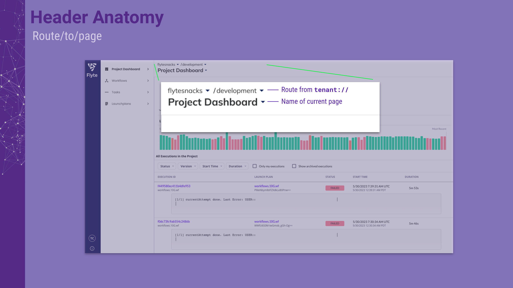
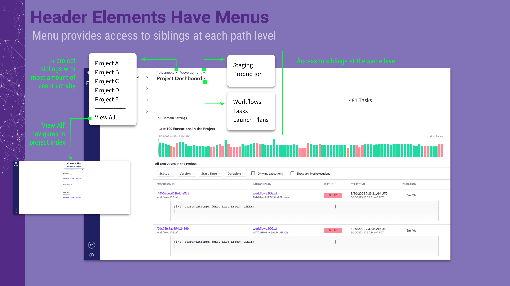
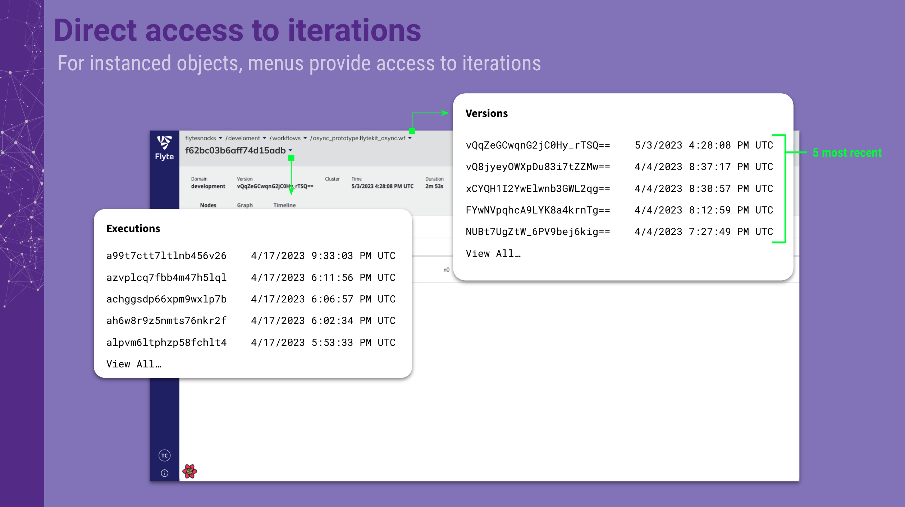

# [RFC Template] Title

**Authors:**

- @tsheiner

## 1 Executive Summary

The proposal is to do a modest branding, orientation & navigation enhancement to the Nebula Console:
1. move the application header to the left side of the viewport
1. introduce consistent bread crumb element on all pages
1. introduce consistent page header on all pages
1. enable the bread crumb & page header elements to also function as navigation controls

## 2 Motivation

The motivation is to respond with usability improvements to the Nebula console in response feedback received from a program of user research that has been initiated by Union.ai. In particular, this proposal introduces initial remediation for 2 specific issues that have been raised:
1.  that the console be more efficient with vertical real estate
1. that it be easier to orient and navigate between node objects and their executions.

## 3 Proposed Implementation

This proposal includes 2 distinct and independent sets of changes. They are bound together here because taken together they create a foundation for further positive change in line with the usability feedback that has been gathered.

The first change is to move the application header that contains the branding and user identity elements from the top of the application window to the left rail. Doing this brings the appearance of the Nebula console more inline with the _de facto_ standard for developer console applications and also frees up ~75px of vertical real estate. The following illustrates this change.

The second change is to introduce breadcrumb and page title elements consistently on all pages. This change is expected to have a positive usability and a11y impact.

In addition to providing a consistent orientation mechanism, the bread crumb and page header elements will also double function as navigational affordances. This is expected to reduce the cognitive load and the clicks required to traverse the application information structure and switch focus between different instanced objects.

Finally, note that current tab-based method of switching between domains will be replaced with the breadcrumb affordance. This provides two benefits:
1. It communicates more clearly to new users the reason for the domain concept
1. It removes the conceptual mismatch between the standard use of tabs as a way to partition information within an application view and the current Nebula use of domain tabs as a way to change runtime context.

## 4 Metrics & Dashboards

The primary metric to be evaluated is user testimony as to impact of the changes. If a more objective measure is required it would be possible to identify 1 or more navigational journeys through the application and count the number of mouse actions required to achieve them with and without the newly proposed components.

## 5 Drawbacks

Drawbacks are minor and are to do with aesthetic preferences and a small amount of required re-learning for existing users regarding how to switch between domains.

## 6 Alternatives

Other visual and stylistic treatments are possible and such suggestions are welcome.

## 7 Potential Impact and Dependencies

The functional impact of these changes is expected to be neutral to positive. The addition of an `h1` page header element on each page is an absolute positive because it creates compliance with a basic a11y requirement. The impact to navigation will be of the opt-in variety because all current navigational affordances are conserved  (with the exception of the domain tabs). Howevere, this forced change in behavior is not expected to be a significant inconvenience because domain switching is not a high frequency action for most users.

## 8 Unresolved questions

NA

## 9 Conclusion

Usability research for Nebula has uncovered one consistent theme: people love the capabilities of the Nebula engine but experience the Nebula console as awkward, idiosyncratic and inconvenient to navigate. The changes proposed here are expected to have a small but positive impact toward reducing the bimodal nature of the user experience and are also foundational steps on a journey to make the Nebula console as beloved as the underlying engine. 

